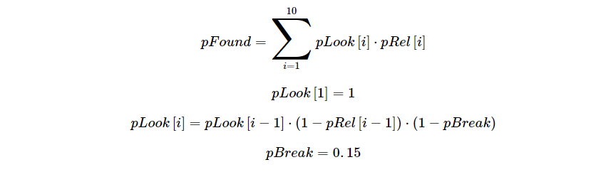
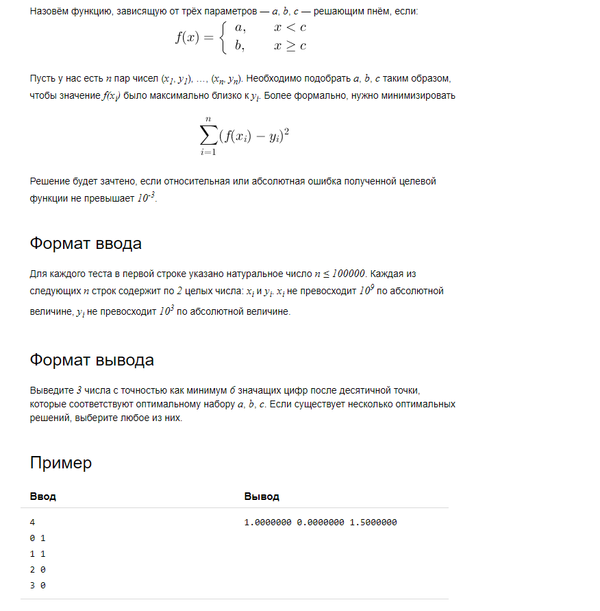
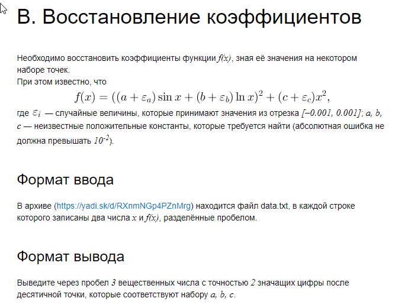
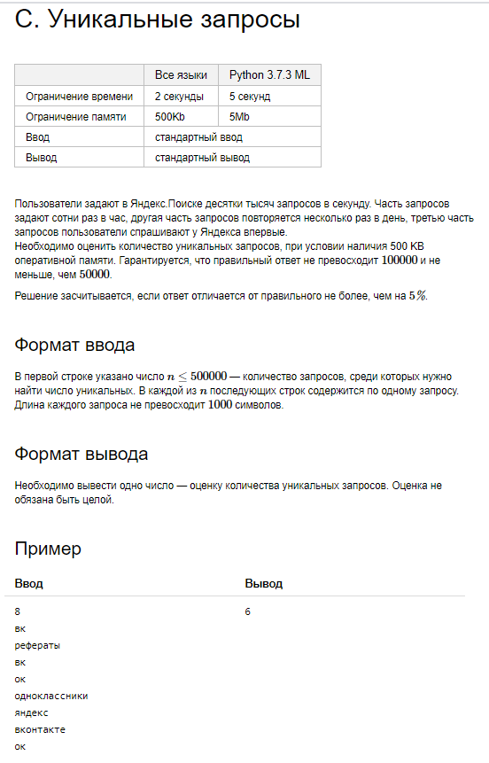
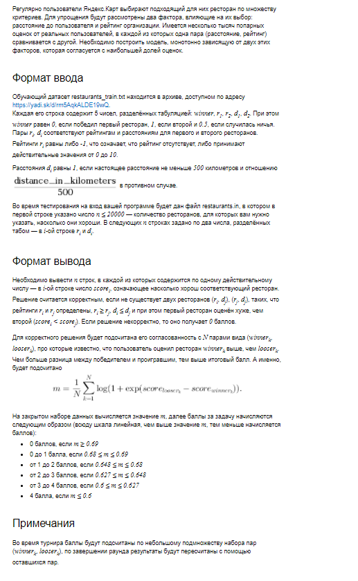

## Yandex Cup 2020
### Analytics track
#### Practice round
**A. Посчитать лгунов в стране**

В государстве живёт 10 000 человек. Они делятся на правдолюбов и лгунов. Правдолюбы говорят правду с вероятностью 80%, а лгуны — с вероятностью 40%. Государство решило подсчитать правдолюбов и лгунов на основе опроса 100 жителей. Каждый раз случайно выбранного человека спрашивают: «Вы лгун?» — и записывают ответ. Однако один человек может поучаствовать в опросе несколько раз. Если житель уже участвовал в опросе — он отвечает то же самое, что и в первый раз. Мы знаем, что правдолюбов 70%, а лгунов 30%. Какая вероятность того, что государство недооценит количество лгунов, т. е. опрос покажет, что лгунов меньше 30%? Дайте ответ в процентах с точкой в качестве разделителя, результат округлите до сотых (пример ввода: 00.00).

**B. Театральный сезон и телефоны**

Международный сервис по продаже билетов решил подвести итоги театрального сезона. В качестве одной из метрик руководитель проекта хочет посчитать количество пользователей, которые покупали билеты на разные спектакли.
При покупке билета пользователь указывает номер своего телефона. Необходимо найти спектакль с наибольшим числом уникальных телефонных номеров. И посчитать количество соответствующих уникальных телефонных номеров.

**C. Рассчитать pFound**

В архиве содержится три текстовых файла:
qid_query.tsv — id запроса и текст запроса, разделённые табуляцией;
qid_url_rating.tsv — id запроса, URL документа, релевантность документа запросу;
hostid_url.tsv — id хоста и URL документа.
Нужно вывести текст запроса с максимальным значением метрики 
pFound, посчитанной по топ-10 документов. Выдача по запросу формируется по следующим правилам:
- С одного хоста может быть только один документ на выдаче. 
- Если для запроса есть несколько документов с одним и тем же id хоста — берется максимально релевантный документ (а если несколько документов максимально релевантны, берется любой).
- Документы по запросу сортируются по убыванию релевантности.
Если у нескольких документов с разных хостов релевантность одинакова, их порядок может быть произвольным.

**D. Спортивный турнир**

Пока Маша была в отпуске, её коллеги организовали турнир по шахматам по олимпийской системе. За отдыхом Маша не обращала особого внимания на эту затею, так что она еле может вспомнить, кто с кем играл (про порядок игр даже речи не идёт). Внезапно Маше пришла в голову мысль, что неплохо бы привезти из отпуска сувенир победителю турнира. Маша не знает, кто победил в финальной игре, но сможет без труда вычислить, кто в нём играл, если только она правильно запомнила играющие пары. Помогите ей проверить, так ли это, и определить возможных кандидатов в победители. 

### Machine learning track
#### Practice round
**A. Решающий пень**

**B. Восстановление коэффициентов**

**C. Уникальные запросы**

**D. Рестораны**

